# SIGEF
Full-stack school and financial management platform built with Laravel, Angular, Docker, and MySQL.

## Overview

SIGEF (Sistema de Gestión Escolar y Financiera) is a full-stack web application designed to manage academic and financial processes within educational institutions. The platform centralizes student administration, payment management, reporting, and secure user authentication in a single system.

## Features
- User authentication and authorization
- Custom refresh token implementation with role-based expiration policies
- Multi-role system with granular permission management
- Student management
- Parent/family accounts for student payment monitoring
- Payment registration and tracking
- Financial administration
- Dashboard and reporting modules
- Responsive user interface
- Secure backend API communication
- Secure payment processing with Stripe
- Stripe webhook integration for payment status tracking
- Queue-based asynchronous processing for emails, Excel imports, and background tasks
- Google Cloud Storage integration for receipt management
- Transactional email notifications with MailerSend
- Scheduled task automation using Laravel Scheduler
  
## Tech Stack

### Frontend
- Angular
- TypeScript
- HTML
- CSS

### Backend
- PHP
- Laravel

### Database
- MySQL

### DevOps & Infrastructure
- Docker
- Railway
- Redis
- Nginx

### Third-Party Services
- Stripe
- MailerSend
- Google Cloud Storage
  
## Docker Environment

The backend infrastructure is fully containerized using Docker and Docker Compose.

The environment includes:

- Laravel application container
- Dedicated queue worker container
- Nginx reverse proxy
- MySQL database
- Redis for queues and caching
- Persistent Docker volumes

## Project Architecture

The backend follows a layered architecture inspired by Hexagonal Architecture principles, separating domain logic, application services, and infrastructure concerns.

### Backend Structure

```plaintext
app/Core
├── Application
│   ├── DTO
│   ├── Services
│   ├── UseCases
│   └── Mappers
├── Domain
│   ├── Entities
│   ├── Repositories
│   └── Enum
└── Infrastructure
    ├── Repositories
    ├── Cache
    └── Mappers
```

### Frontend Structure

```plaintext
src/app
├── core
├── features
├── layouts
└── shared
```

## Running Locally

### Backend

```bash
cd backend/school-management

cp .env.example .env
```

Configure the initial administrator account in the `.env` file:

```env
ADMIN_EMAIL=
ADMIN_PASSWORD=
ADMIN_FIRST_NAME=
ADMIN_LAST_NAME=
ADMIN_PHONE=
ADMIN_CURP=
```

Then start the Docker environment:

```bash
docker compose up --build
```

### Frontend

```bash
cd frontend/school-management

npm install

ng serve
```

## Ongoing Improvements

- Frontend redesign and UI modernization
- Backend performance and architecture optimizations
- Mobile responsiveness improvements
- Extended audit logging and monitoring
- Additional reporting and analytics features

---

## Screenshots

### Authentication

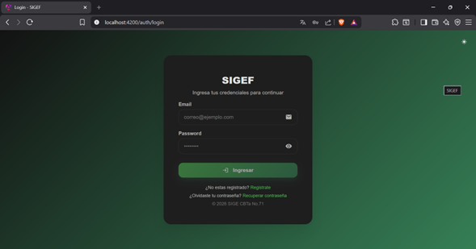
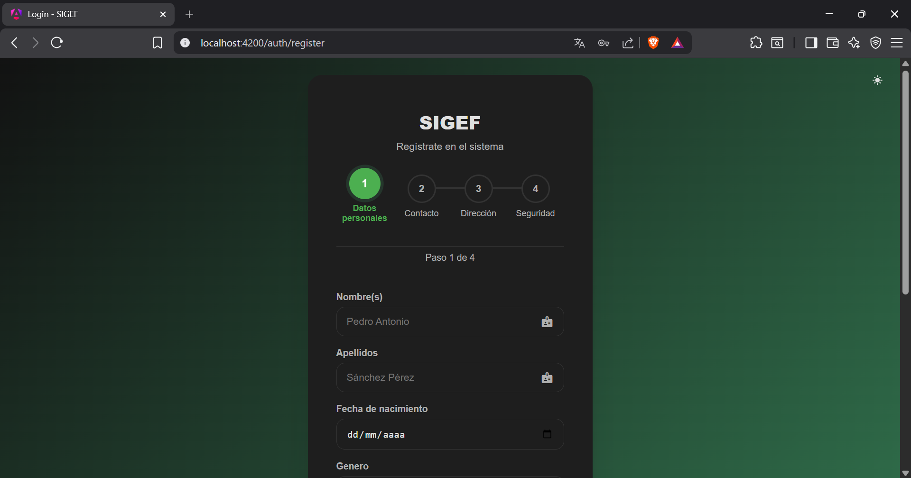

### Common

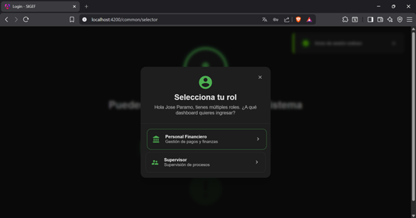
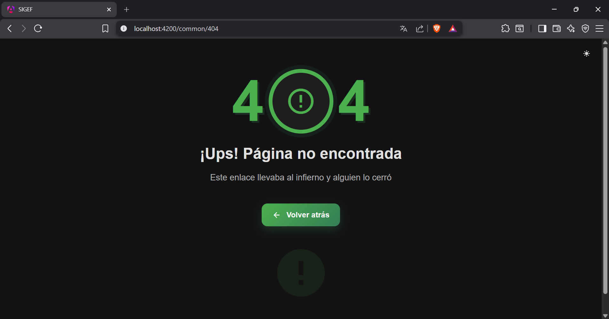
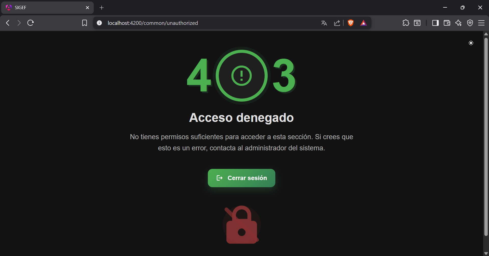
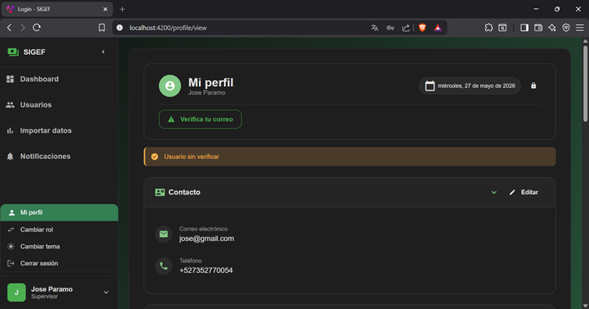
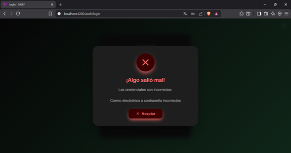


### Admin
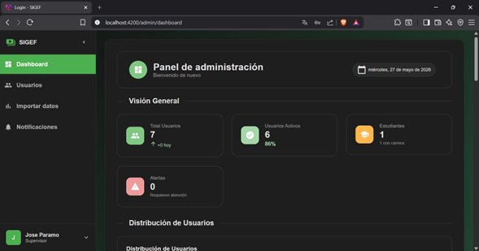
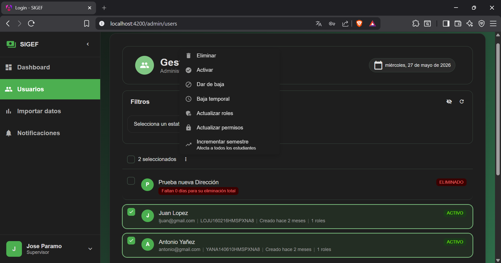
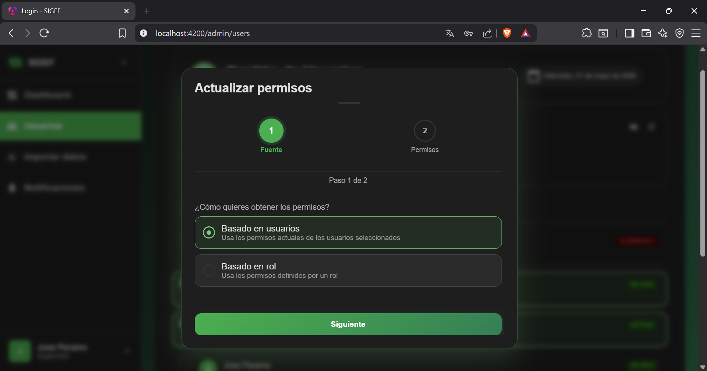
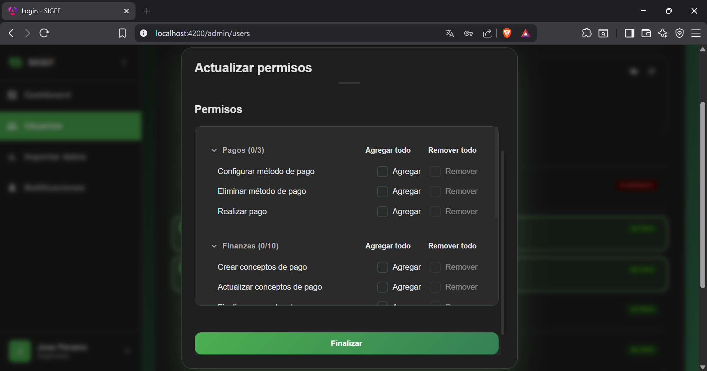
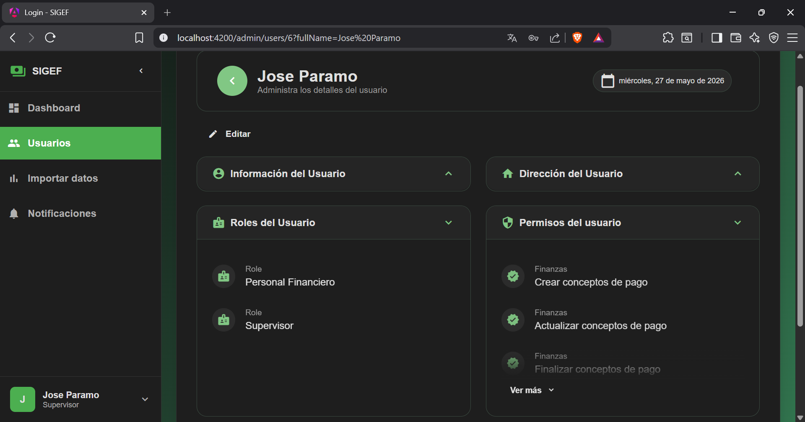
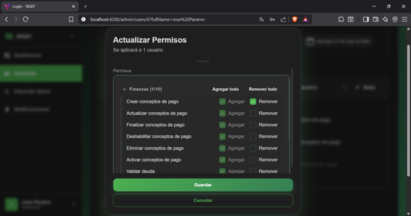
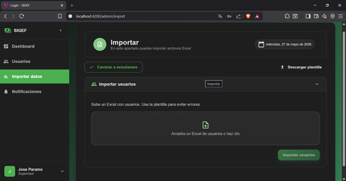

### Financial staff
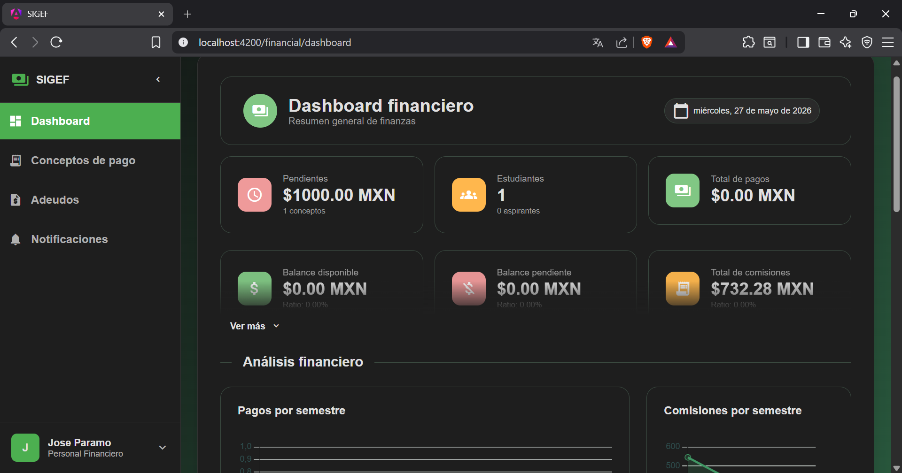
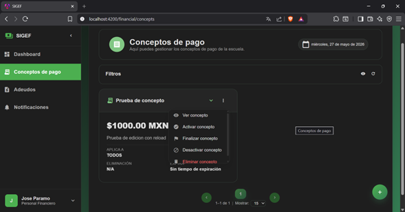
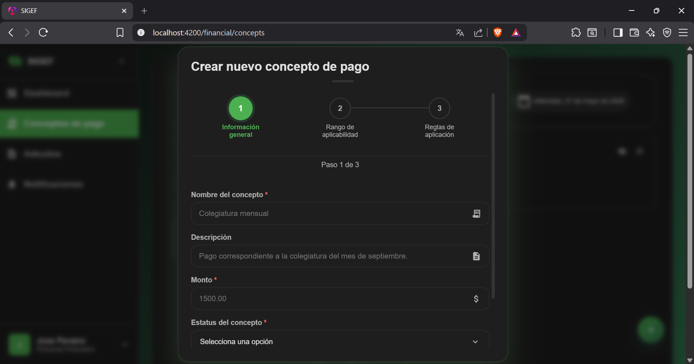
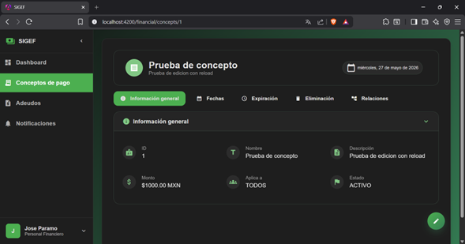
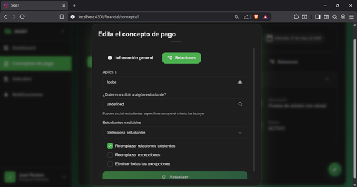
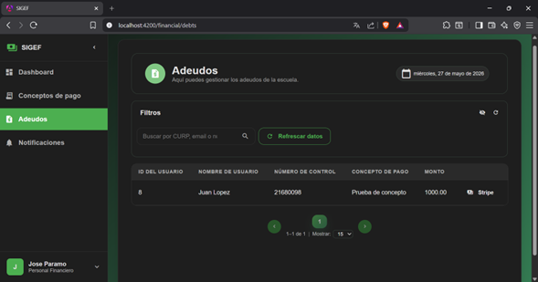

## Demo
Short walkthrough of the authentication flow, dashboard navigation, and financial management modules.


## Author

Developed by Angel López Yáñez.
